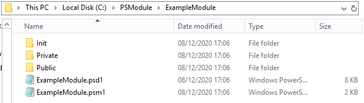

# Convert-ScriptToModule
This is a PowerShell function to convert one or more ps1 files with several separate functions into a PowerShell module.

## Summary 
When I'm developing in PowerShell, I tend to create all my functions in one ps1 file while I'm developing it, as I find it easier to edit & compile quickly. I created this function to convert one or more ps1 files containing multiple functions, into a PowerShell module with everything included. The function will;
* Create a module directory with a given module name
* Divide all functions into their own self-named script files
* Initialise the psm1 and psd1 files with the required parameters and code to load the module properly
* Divide the functions into Public and Private modules - functions are Public by default, Private functions are set using the **-Private** parameter. 
* Detect Argument Completers and put them into an initialisation file, which is also loaded by the generated psd1 file. 
* Scan the file(s) for any "#requires" for any required modules or PowerShell version, and add them into the psd1 file.
* Add the Public functions to the "FunctionsToExport" parameter in the psd1 file.

## Usage 

One thing to note before using this function, the source scripts have to be formatted a certain way. For function names to be discovered correctly, the line with the function declaration needs to have the opening curly bracket on the same line, or on the line immediately after it. 

The closing bracket for the function needs to be at the very start of it's own line, without any spaces before it. So make sure there is no closing brackets at the very start of any line UNLESS it's a function ending.
A handy way to make your script adhere to these rules is to open it in VSCode and press Shift+Alt+F - this will format the document to best practices. Here are examples of what this means;
```` powershell
#Open curly bracket on same line as function declaration
function Get-Example {
    ...
} #no spaces before this curly bracket
````
OR 
```` powershell
#Open curly bracket on line immediately after the function declaration 
function Get-Example
{
    ...
} #no spaces before this curly bracket
````


### Example 1
```` powershell
Convert-ScriptToModule -ScriptPath "C:\PSScripts\AllInOne.ps1" -ModuleName TestModule -ModulePath "C:\PSmodules"
````
This example will read the AllInOne.ps1 file and extract all functions or argument completers, as well as any #require tags to determine any RequiredModules for the psd1 file. 
- The module directory will be created at "C:\PSmodules\TestModule"
- Each function will be placed in it's own self-named .ps1 file within a \Public folder in the module directory
- Argument completers will be placed within \Init\LoadArgumentCompleters.ps1
- The psd1 and psm1 files will be generated, with the required parameters such as any RequiredModules, PowerShellVersion and FunctionsToExport

### Example 2
```` powershell
Convert-ScriptToModule -ScriptPath "C:\PSscripts\AllInOne.ps1", "C:\PSscripts\Get-Example.ps1"  -ModuleName TestModule -ModulePath "C:\PSmodules" -PrivateFunctions "Get-PsExample"
````

This example will read both given files for any functions or argument completers and output it into a single module called TestModule. It will do the same steps as Example 1, except the function "Get-PsExample" will be created as a private function and placed in the \Private directory

## Output
Example of what gets created is below. The command used for this example is;
```` powershell
Convert-ScriptToModule -ScriptPath "C:\PsScriptsAllInOne.ps1" -ModuleName "ExampleModule" -ModulePath "C:\PSModule\" -PrivateFunctions "Get-Example1", "Get-Example2" -verbose

````

As you can see below, this command has created the module directory for the "ExampleModule" module, and placed it into the "C:\PSModule" folder, with Private, Public, and Init folders, as well as the psd1 and psm1 files. The Private folder will contain the "Get-Example1" and "Get-Example2" functions as specified in the command, all other functions will be placed into the Public folder and exported in the psm1 and psd1 file. The Init folder will contain any ArgumentCompleters found within the files, and that will also be loaded in the psm1 file. 




Once the module is created this way, you can import your newly created module using;
````powershell
Import-Module "C:\PSModule\ExampleModule"
````